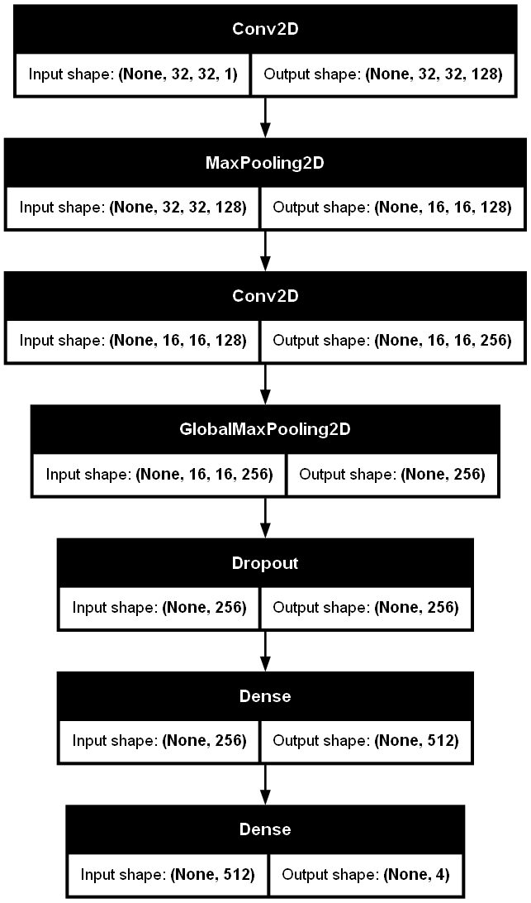

# Обучение с подкреплением

## Метод Кросс-Энтропии (Cross-Entropy Method)

> **Цель обучения**: Оптимизировать поведение овец (агентов) через нейронную сеть для максимизации накопленной награды.

### Система наград

#### Для овец (Sheep):

| Ситуация                  | Награда       | Флаг | Логика                                  |
|---------------------------|---------------|-------|----------------------------------------|
| Перемещение на пустую клетку | new_cost - cost  | 0     | Разница стоимости новой и старой позиции |
| Съедание травы (Weed)     | +1000         | 1     | Уничтожение травы с полным вознаграждением |
| Столкновение с овцой      | -500          | 0     | Возврат на исходную позицию             |
| Встреча с волком (Wolf)   | -10000        | 0     | Волк остаётся на клетке                  |

#### Для волков (Wolf):

| Ситуация                  | Награда       | Флаг | Логика                                  |
|---------------------------|---------------|-------|----------------------------------------|
| Съедание овцы (Sheep)     | -100 у овцы   | 0     | Овца получает штраф, волк остаётся     |
| Попытка съесть траву      | 0             | 1     | Трава уничтожается без вознаграждения  |
| Столкновение с волком     | 0             | 0     | Возврат на исходные позиции             |

### Инициализация

1. Создается нейронная сеть для агентов

**Архитектура**

```
model = Sequential([
    Input(shape=input_shape, name='input_layer'),
    Conv2D(128, (3,3), activation='relu', padding='same', name='conv2d_1'),
    MaxPool2D(name='maxpool'),
    Conv2D(256, (3,3), activation='relu', padding='same', name='conv2d_2'),
    GlobalMaxPooling2D(name='global_max_pool'),
    Dropout(0.3, name='dropout'),
    Dense(512, activation='relu', name='dense_512'),
    Dense(4, activation='softmax', name='output_layer')  # 4 класса для классификации направлений
], name='SheepBrain')
```

На входе сеть состоит из сверточный слой, которые обрабатывают входную матрицу состояния среды. Далее происходи передача данных в скрытый слой сверточной сети через `MaxPool2D`. Второй сверточный слой видит большую область, чем первый, при этом число фильтров увеличено в два раза. Далее слой  `GlobalMaxPooling2D` выделяет только сильные сигналы сверток и передает на полносвязный скрытый слой. Последний слой принимает 512 нейронов и решает какое действие выбрать для агента.




2. Инициализируются метрики:

```
history = {
    'mean':[],     # Средня награда для каждого выбранного действия овцы
    'weed': [],    # Количество съеденной травы за время одной симуляции
    'ttl': [],     # Время жизни симуляции (количество "дней")  
    'losses': [],  # Последняя ошибка на валидационной выборке
    'accuracy': [] # Последняя точность на валидационной выборке
}
```

### Цикл обучения (эпохи)

1. Подготовка симуляции:

```
height, width = 64, 128
shape = (height, width)
g = GameOmniHunter(shape)
g.start(model, height//4, height//12)
g.add(2*width)
```

2. Прогон симуляции до уничтожения всх овец

3. Сбор данных:

- Собираем все rewards и находим среднюю награду за эпоху
- Отбор "элитных" примеров, тех что выше средне награды

4. Обновление политики:

- Нейросеть переобучается на "успешных" примерах

**Цель:** увеличить вероятность "хороших" действий в аналогичных состояниях

Эффект закрепления:

- После обучения агенты чаще выбирают действия, приводившие к успеху
- Постепенное улучшение стратегии сбора травы и избегания опасностей


5. Стабилизация обучения:

- EarlyStopping: предотвращение переобучения
- ReduceLROnPlateau: динамическое уменьшение шага обучения
- Валидация на 20% данных (validation_split=0.2)
- Dropout слои для предотвращения переобучения

6. Адаптация ресурсов:

Количество добавляемой травы = съеденной на предыдущем шаге

Динамический баланс экосистемы


7. Эволюция стратегии

a. Начальная фаза:

- Случайное поведение овец
- Низкая эффективность сбора травы
- Частые столкновения с волками


b. Промежуточная фаза:

- Появление простых паттернов
- Движение к ближайшей траве
- Избегание границ поля
- Увеличение средней награды


c. Продвинутая фаза:

- Координированное поведение:
- "Стайный" сбор травы
- Предсказание движений волков
- Оптимальные маршруты
- Максимизация награды при минимизации рисков

