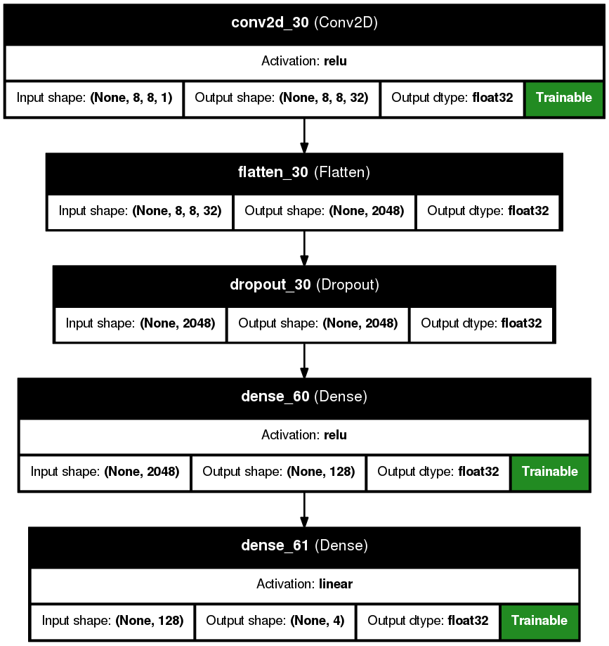
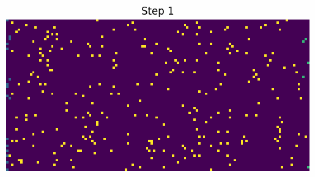

# Обучение с подкреплением

## Q-learning

> **Цель обучения**: Оптимизировать поведение овец (агентов) через нейронную сеть для максимизации накопленной награды.

- В тестовой среде агент ходит согласно начальной политике - случайно.
- Формируется кумулятивная награда с коэффициентом дисконтирования `gamma=0.95`.
- Выбирается состояние и его последующие `lvl_discont=6` шагов (глубина дисконтирования).
- Обновление политики (обучение нейросети).

### Система наград

#### Для овец (Sheep):

| Ситуация                | Награда |
|-------------------------|--------|
| Исследование территории |     1  |
| Съедание травы          |    10  |
| Столкновение с овцой    |     0  |
| Встреча с волком        |  -100  |
| Столкновение со стеной  |     0  |
| Рядом волк              |   -50  |
| РядомзЗапах волка       |   -10  |


### Инициализация

1. Создается нейронная сеть для агентов

**Архитектура**

```
Sequential([
        Input(shape=(8, 8, 1) , name='input_layer'),
        Conv2D(32, 8, activation='relu', padding='same'),
        Flatten(),
        Dropout(0.3),
        Dense(128, activation='relu'),
        Dense(4)
    ], name='SheepBrain')
```




### Цикл обучения

1. Подготовка симуляции:

```
height, width = 32, 24
shape = (height, width)
g = GameOmniHunters(shape)
g.start(model, height//4, height//12)
g.add(2*width)
```

2. Прогон симуляции до уничтожения всех овец или наступление 100 шага.

> изначально агенты ходят случайно `epsilon=1`. С ростом количества шагов epsilon уменьшается и начинает работать нейросеть по `argmax`.

4. Создание семплов для обучения нейросети по формуле Беллмана:

$$
Q(s, a) = r + \gamma \max_{a'} Q(s', a')
$$

> сеть заглядвает на 6 шагов вперед, с диконтированием 0.95.

5. Повтр симуляций до накопления 2000 экземпляров состояний и наград.

4. Обновление политики q-значений.

Эффект закрепления:

- После обучения агенты чаще выбирают действия, приводившие к успеху.
- Постепенное улучшение стратегии сбора травы и избегания опасностей.

5. Стабилизация обучения:

- EarlyStopping: предотвращение переобучения.
- ReduceLROnPlateau: динамическое уменьшение шага обучения.
- Валидация на 20% данных (validation_split=0.2).
- Dropout слои для предотвращения переобучения.

6. Адаптация ресурсов:

- Количество добавляемой травы = уничтоженной на предыдущем шаге.
- Динамический баланс экосистемы.

7. Эволюция стратегии

a. Начальная фаза:

- Случайное поведение овец.
- Низкая эффективность сбора травы.
- Частые столкновения с волками.



b. Промежуточная фаза:

- Появление простых паттернов.
- Движение к ближайшей траве.
- Увеличение средней награды.


c. Продвинутая фаза:

- Координированное поведение:
- "Стайный" сбор травы.
- Предсказание движений волков.
- Оптимальные маршруты.
- Максимизация награды при минимизации рисков.


