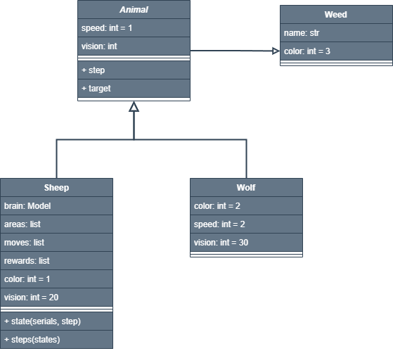

# Основные классы

## Weed (Трава)

**Атрибуты:**

- `name` - уникальное имя объекта
- `color` = 3 - идентификатор для визуализации

**Методы:**

`__init__(name)` - инициализация объекта травы

## Animal (Базовый класс для животных)

**Атрибуты:**

- `speed` = 1 - скорость перемещения (клеток/ход)
- `vision` - радиус обзора (должен быть переопределен в подклассах)

**Методы:**

- `target(area, color) -> (coords, distance)`
Находит ближайший объект указанного цвета в области видимости
Возвращает координаты и расстояние по Манхэттену
- `cost(area, color) -> int`
Вычисляет "стоимость" позиции относительно цели
- `@abstractmethod step(area) -> int`
Определяет направление движения (0-вверх, 1-вправо, 2-влево, 3-вниз)

## Sheep (Овца)

Наследует: `Animal`

**Атрибуты:**

- `color` = 1 - идентификатор овцы
- `vision` = 32 - дальность обзора
- `brain` - нейронная сеть для принятия решений (общая для всех овец)
- `areas`, `moves`, `rewards` - история наблюдений, действий и наград

**Методы:**

- `state(serials, step) -> np.array` - состояние агента, для подачи в нейросеть
- `step(area) -> int` - предсказывает движение с помощью нейросети
- `@classmethod steps(areas) -> list` - пакетное предсказание движения группы агентов.

## Wolf (Волк)

Наследует: `Animal`

**Атрибуты:**

- `color` = 2 - идентификатор волка
- `vision` = 64 - увеличенная видимость, по сравнению с овцой
- `speed` = 2 - более быстрое перемещение

**Методы:**

- `step(area) -> int` - определяет направление к ближайшей овце по Манхэттенскому расстоянию.

