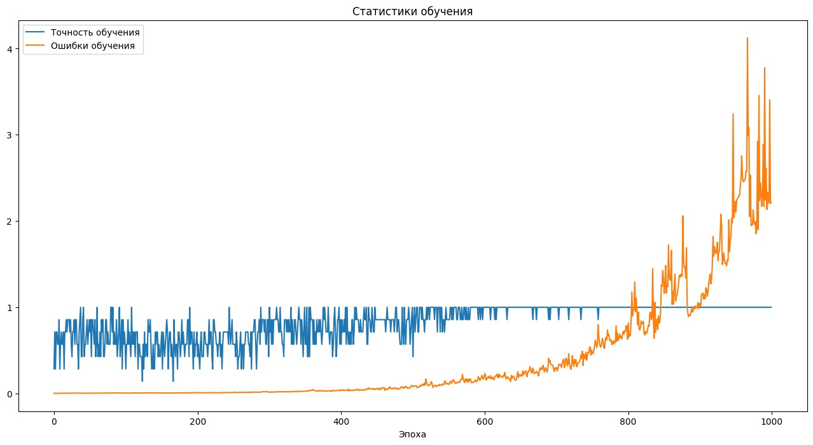
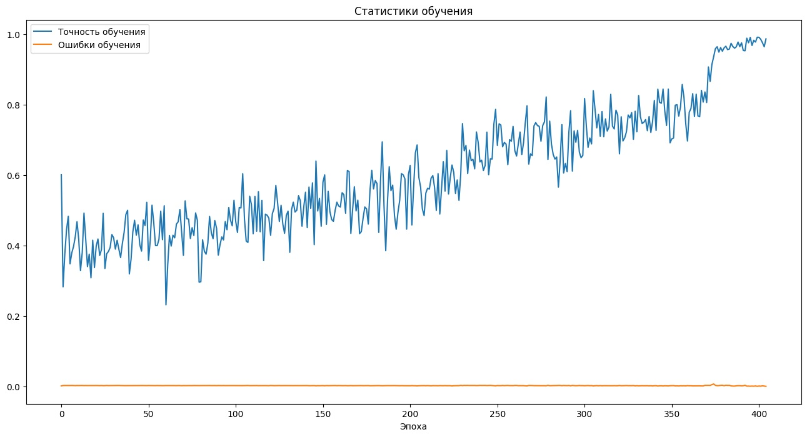
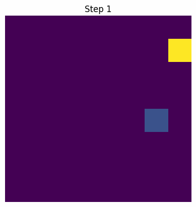
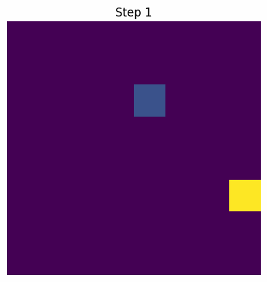
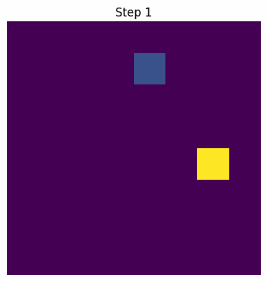
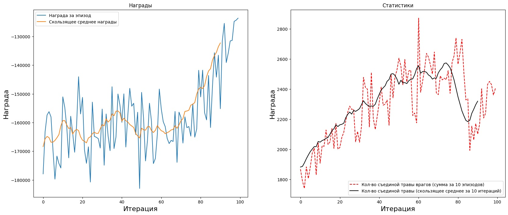

# Результаты

## Проблемы

**Автокорреляция**

Если проводить обучение сразу после каждой симуляции, данные, а именно состояния, оказываются взаимно коррелированными, что приводит к переобучению.




**Решение**

Накопление данных, их перемешивание и только потом обучение.



**Коализия states и перезаписывание q-values**

В процессе формирования обучающего датасета для Q-learning или DQN возникает ситуация, когда одно и то же состояние среды (state) может встречаться несколько раз, но с разными действиями и целевыми Q-значениями. Это связано с тем, что агент в разное время может попадать в одну и ту же ситуацию, но выбирать различные действия, что приводит к разным последствиям и, соответственно, разным значениям награды и целевым Q-value для каждой пары (state, action).

В классической реализации, если при каждой итерации мы добавляем в датасет новую запись для каждой пары (state, action), то одно и то же состояние будет встречаться в выборке многократно, но с разными заполненными компонентами Q-вектора (каждый раз только для одного действия). Это приводит к:

- избыточности данных (дублирование состояний),
- неэффективному использованию памяти,
- возможному переобучению на частых состояниях,
- размыванию целевых значений Q для одинаковых состояний, так как модель видит их как разные примеры с частично заполненными Q-векторами.

**Решение**

Рациональным решением является агрегирование информации по уникальным состояниям. Для этого при формировании датасета необходимо:

- Использовать структуру данных, которая позволяет быстро определять, было ли состояние уже добавлено (например, словарь с хэшами состояний).
- Если состояние встречается впервые, добавить его в датасет и сохранить соответствующий Q-вектор, где только одно значение (для выбранного действия) обновлено, а остальные — предсказаны текущей моделью.
- Если состояние уже есть в датасете, не добавлять его повторно, а просто обновить соответствующее значение Q для нового действия, оставив остальные компоненты Q-вектора без изменений.

Такой подход обеспечивает:

- отсутствие дублирующихся состояний в обучающей выборке,
- наличие для каждого состояния полного Q-вектора, где для всех известных действий значения Q актуализированы,
- более стабильное и корректное обучение нейронной сети, так как каждое состояние представлено ровно один раз с максимально полной информацией о Q-значениях по всем действиям.

Пример реализации:

```
state_index_map = dict()
x, y = [], []
for i, (current_state, target_q, action) in enumerate(data):
    state_hash = hash(current_state.tobytes())
    if state_hash in state_index_map:
        index = state_index_map[state_hash]
        y[index][action] = target_q[action]
    else:
        x.append(current_state)
        y.append(target_q)
        state_index_map[state_hash] = len(x) - 1
```

Таким образом, агрегирование целевых Q-значений по уникальным состояниям позволяет повысить эффективность использования данных, уменьшить объем памяти и улучшить качество обучения Q-функции.

## Баги

Добавление параметра smell (запах следов) животных — хорошая идея.

Однако после анализа поведения овец я заметил баг: они начали бегать взад-вперед на одном месте, а волки не подходили к ним, словно их не видели. При изучении окружения овцы выяснилось, что запах затирал положение овцы, то есть фактически удалял её, и волк видел только запах, но не саму овцу. Искусственный интеллект обнаружил этот баг и создал забавный паттерн поведения.



Или еще хитрее, затирала следы, упиралась в борт и неподвижно сидела. Как только волк уходил, овца сразу выбегала, но её быстро ловили.



После внесения исправлений такой трюк уже не удался.




## Сходимость обучения



По графику видно, что в среднем общее количество наград растет, включая полезные награды.
